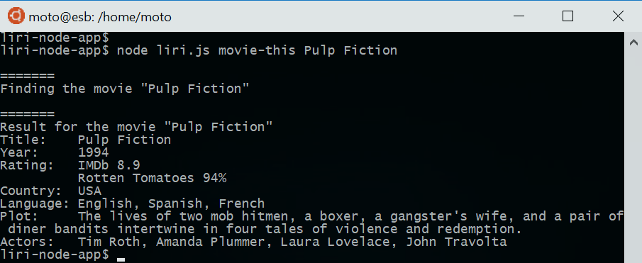

# LIRI Bot

### Overview

LIRI is like iPhone's SIRI. However, while SIRI is a Speech Interpretation and Recognition Interface, LIRI is a _Language_ Interpretation and Recognition Interface. LIRI will be a command line node app that takes in parameters and gives you back data.

### Description

LIRI understands and reponds to the following four commands:
  1) concert-this
  2) spotify-this-song
  3) movie-this
  4) do-what-it-says

#### Usages and Outputs (requirements)

1. `node liri.js concert-this <artist/band name>`
    * This will search the Bands in Town Artist Events API for an artist
      and render the following information about each event to the terminal:
      * Name of the venue
      * Venue location
      * Date of the Event ("MM/DD/YYYY")

2. `node liri.js spotify-this-song <song name>`
    * This will show the following information about the song in terminal.
      * Artist(s)
      * The song's name
      * A preview link of the song from Spotify
      * The album that the song is from
      * If no song is provided then your program will default to "The Sign" by Ace of Base.

3. `node liri.js movie-this <movie name>`
    * This will output the following information to your terminal/bash window:
      * Title of the movie.
      * Year the movie came out.
      * IMDB Rating of the movie.
      * Rotten Tomatoes Rating of the movie.
      * Country where the movie was produced.
      * Language of the movie.
      * Plot of the movie.
      * Actors in the movie.
    * If the user doesn't type a movie in, the program will output data for the movie 'Mr. Nobody.'

4. `node liri.js do-what-it-says`
    * LIRI will take the text inside of random.txt and then use it to call one of LIRI's commands.
    * Multiple LIRI commands can be listed one command per line.

### Files
```
.gitignore                -- GIT ignore file
README.md                 -- this file
homework_instructions.md  -- original requirements and instructions
keys.js                   -- API keys through doenv module
liri.js                   -- main app javascript
package.json              -- npm package file
random.txt                -- sample input file for "do-what-it-says"
```
### A file not included
```
.env   -- to be read by dotenv module
```
The .env file should include the following API keys
```
#Spotify API keys
SPOTIFY_ID=<your ID>
SPOTIFY_SECRET=<your SECRET>

#Bands in Town app_id
BANDSINTOWN_ID=<your APP ID>

#OMDB apikey
OMDB_KEY=<your API key>
```

### Examples

1. Search concerts for an artist or a band
    `node liri.js concert-this <artist/band name>`

    * Without `<artist/band name>`, there will be no result.
      

    * With `<artist/band name>`. Search for "Bruno Mars" and "Foo Fighters" for example.
      

2. Search a song on Spotify
    `node liri.js spotify-this-song <song name>`

    * Default without a `<song name>` argument, the result will be "The Sign" by "Ace of Base".
      

    * With `<song name>`. Search for "We will rock you" for example.
      

3. Search a movie info on OMDb
    `node liri.js movie-this <movie name>`

    * Default without a `<movie name>` argument, the result will be for the movie "Mr. Nobody".
      

    * With `<movie name>`. Search for "Pulp Fiction" for example.
      

4. Run multiple searches based on a text file, random.txt
    `node liri.js do-what-it-says`

    * In the following example, The input file "random.txt" contains 4 commands:
        ```
        spotify-this-song,"I Want it That Way"
        movie-this,Star Wars
        concert-this,Maroon 5
        spotify-this-song
        ```

    * Please note the order of the command outputs will be random because the queries are run asynchronously.
        ```
        liri-node-app$ node liri.js do-what-it-says
        Reading ./random.txt ...
        [ 'spotify-this-song,"I Want it That Way"',
          'movie-this,Star Wars',
          concert-this,Maroon 5',
          'spotify-this-song',
          '' ]

        It says, spotify-this-song "I Want it That Way", on line 1

        =======
        Searching for the song ""I Want it That Way""

        It says, movie-this Star Wars, on line 2

        =======
        Finding the movie "Star Wars"

        It says, concert-this Maroon 5, on line 3

        =======
        Finding concerts for "Maroon 5"

        It says, spotify-this-song, on line 4

        =======
        Searching for the song "The Sign Ace of Base"

        =======
        Result for "Maroon 5" concerts
        - 1 -
          Venue: Mandalay Bay Events Center
          Location: Las Vegas, NV, United States
          Date: 12/30/2018
        - 2 -
          Venue: Mandalay Bay Events Center
          Location: Las Vegas, NV, United States
          Date: 12/31/2018
        - 3 -
          Venue: Brisbane Entertainment Centre
          Location: Brisbane, Australia
          Date: 02/19/2019
        - 4 -
          Venue: Qudos Bank Arena
          Location: Sydney, Australia
          Date: 02/21/2019
        - 5 -
          Venue: Rod Laver Arena
          Location: Melbourne, Australia
          Date: 02/22/2019

        =======
        Seach result for the song ""I Want it That Way""
        - 1 -
          Artist(s): Backstreet Boys
          Song Name: I Want It That Way
          Link: https://open.spotify.com/track/6e40mgJiCid5HRAGrbpGA6
          Album: The Hits--Chapter One
        - 2 -
          Artist(s): Backstreet Boys
          Song Name: I Want It That Way
          Link: https://open.spotify.com/track/47BBI51FKFwOMlIiX6m8ya
          Album: Millennium
        - 3 -
          Artist(s): Anthem Lights
          Song Name: I Want It That Way
          Link: https://open.spotify.com/track/3Ww6kEWxLh4Ub4WPJ9hMtA
          Album: Covers Part IV
        - 4 -
          Artist(s): Tyler and Mark
          Song Name: I Want It That Way
          Link: https://open.spotify.com/track/7k52T0b1v9ktm2gJwlO5yy
          Album: Beautiful Dreams
        - 5 -
          Artist(s): Dynamite Boy
          Song Name: I Want It That Way
          Link: https://open.spotify.com/track/0F5f29urvisi4TiwJOQZWN
          Album: Punk Goes Pop

        =======
        Seach result for the song "The Sign Ace of Base"
        - 1 -
          Artist(s): Ace of Base
          Song Name: The Sign
          Link: https://open.spotify.com/track/0hrBpAOgrt8RXigk83LLNE
          Album: The Sign (US Album) [Remastered]
        - 2 -
          Artist(s): Ace of Base
          Song Name: All That She Wants
          Link: https://open.spotify.com/track/6kWJvPfC4DgUpRsXKNa9z9
          Album: The Sign (US Album) [Remastered]
        - 3 -
          Artist(s): Ace of Base
          Song Name: The Sign
          Link: https://open.spotify.com/track/3DYVWvPh3kGwPasp7yjahc
          Album: Greatest Hits
        - 4 -
          Artist(s): Ace of Base
          Song Name: Don't Turn Around
          Link: https://open.spotify.com/track/4SYMibQ93bfzOk6uzkF0dO
          Album: The Sign (US Album) [Remastered]
        - 5 -
          Artist(s): Ace of Base
          Song Name: Living in Danger
          Link: https://open.spotify.com/track/5ICwDM1fzgqv7HNFUIjPyx
          Album: The Sign (US Album) [Remastered]

        =======
        Result for the movie "Star Wars"
        Title:    Star Wars: Episode IV - A New Hope
        Year:     1977
        Rating:   IMDb 8.6
                  Rotten Tomatoes 93%
        Country:  USA
        Language: English
        Plot:     Luke Skywalker joins forces with a Jedi Knight, a cocky pilot, a Wookiee and two droids to save the galaxy from the Empire's world-destroying battle station, while also attempting to rescue Princess Leia from the evil Darth Vader.
        Actors:   Mark Hamill, Harrison Ford, Carrie Fisher, Peter Cushing
        liri-node-app$
        ```
